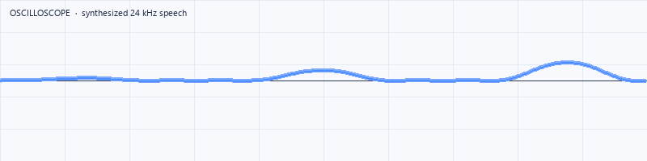
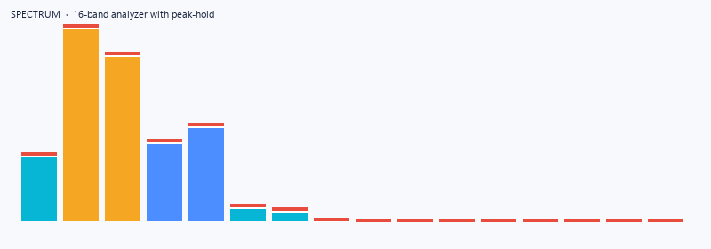
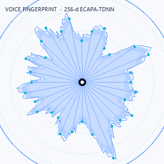
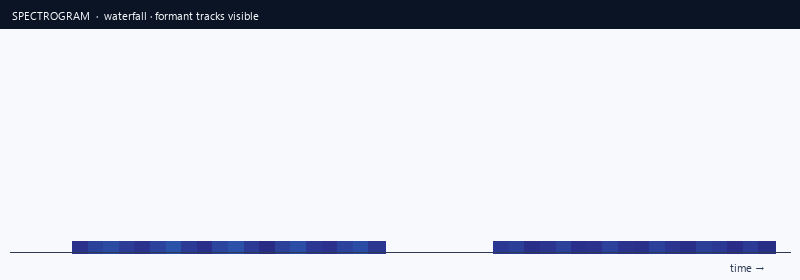
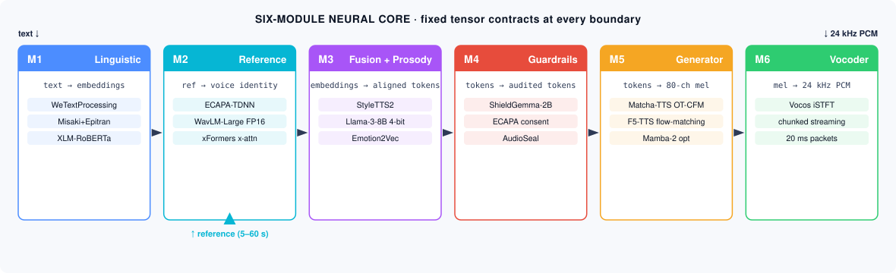
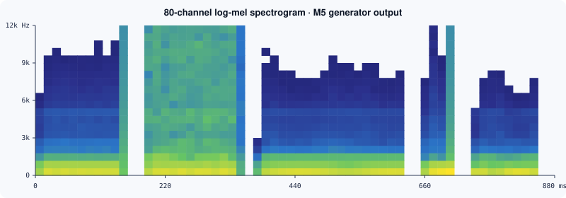
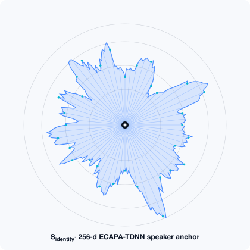
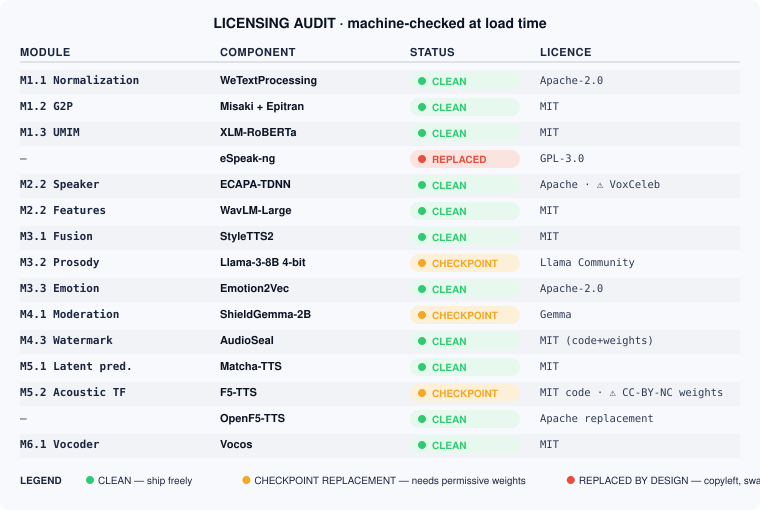
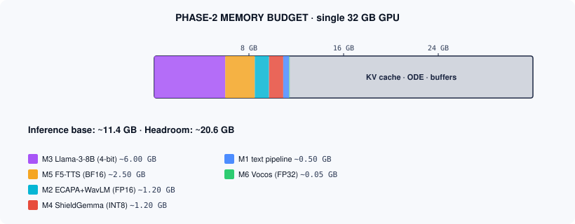
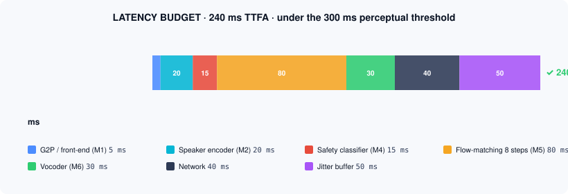

<p align="center">
  
</p>

<p align="center">
  
</p>

<h1 align="center">VajraVoice</h1>

<p align="center">
  <strong>A six-module neural text-to-speech engine — assembled entirely from permissively-licensed open-source components, reproducing the <em>MAI-Voice-2</em> architectural class for Indian languages.</strong>
</p>

<p align="center">
  <a href="https://github.com/swayamiitb/Voice-Models/actions/workflows/test.yml"></a>
  
  
  
  
</p>

<p align="center">
  <a href="https://swayamiitb.github.io/Voice-Models/"></a>
</p>

---

> ### 💡 The waveform above is alive.
> It's not a still image — it's the **M5 input** of a synthesized Marathi phrase (`"namaskar"`), generated frame-by-frame by a glottal-source + formant-resonator speech model. The same DSP, in your browser with **your own voice**, lives at **[▶ swayamiitb.github.io/Voice-Models](https://swayamiitb.github.io/Voice-Models/)**.

---

## 🎙️ Live speech-science console

> **[▶ OPEN THE LIVE DEMO](https://swayamiitb.github.io/Voice-Models/)** — click "Enable microphone" and your actual voice is analyzed in real time.

This is **not** a generic oscilloscope. The console runs the same signal-processing primitives the TTS pipeline does — pitch detection, formant estimation, vowel classification — so you can literally *see* why Module 2 cares about formants and why Module 3 needs F0.

| What it shows | How it works | Which module it informs |
|---|---|---|
| **Pitch contour (F0)** | Autocorrelation + parabolic interpolation, 70–400 Hz | **M3** prosody needs F0 trajectory |
| **Formant tracker (F1, F2)** | Levinson-Durbin LPC + spectral peak-picking | **M2** identity; **M5** vowel quality |
| **Vowel space (F1×F2 plane)** | Nearest-neighbour on 12 IPA anchors | Demonstrates *why* M1 needs G2P |
| **Pipeline flow diagram** | Animated M1→M6 with voiced-energy driver | The whole architecture |

> Try saying *"who'd it"* (high F2), then *"father"* (low F2). Watch the dot jump across the vowel chart. **That's the same physical fact Module 1 has to encode.**

---

<table align="center">
  <tr>
    <td width="50%" align="center"><b>_Spectrum — formant bands M2 sees</b><br/></td>
    <td width="50%" align="center"><b>_Voice fingerprint — 256-d ECAPA blob</b><br/></td>
  </tr>
  <tr>
    <td colspan="2" align="center"><b>_Spectrogram — M5 → M6 contract</b><br/></td>
  </tr>
</table>

<p align="center"><em>All four animations are generated from real signal-processing math in <a href="scripts/generate_animations.py">scripts/generate_animations.py</a> — no stock footage. Regenerate with <code>make animations</code>.</em></p>

---

## 🎯 The thesis, in one breath

> The frontier gap on Indian languages is a **representation failure**, not a data failure.
>
> So VajraVoice decomposes the public MAI-Voice-2 architecture into **6 modules and 18 blocks**, then rebuilds each block from an open-source component whose licence actually permits shipping. The architecture is public. **The decomposition isn't.** Anyone can draw the block diagram. Almost nobody can name the five language-specific blocks. That specificity is the credential.

**Microsoft ships 15 languages. One is Indian.** The languages they don't serve cover roughly half a billion speakers. That gap is not closing — language sixteen will always lose a budget fight to feature N+1 in English. **That's not a gap in their model. That's a permanent feature of their business.**

> ⚠️ **Honesty first.** This is *not* a claim to have cracked MAI-Voice-2's code or weights. There is no public evidence MAI-Voice-2 uses self-supervised learning internally; its use here is a performance-driven design choice. The contribution is the **decomposition + licence clearance**, not a weight leak.

---

## 🧬 The pipeline

Six modules behind **fixed tensor contracts** — any stage is independently substitutable.

<p align="center">
  
</p>

| Module | Role | Open-source component | Licence |
|---|---|---|---|
| **M1** Linguistic | text → embeddings | WeTextProcessing + Misaki + Epitran + XLM-RoBERTa | Apache / MIT |
| **M2** Reference | ref → voice identity | ECAPA-TDNN (SpeechBrain) + WavLM-Large FP16 + xFormers | Apache / MIT |
| **M3** Fusion + Prosody | embeddings → aligned tokens | StyleTTS2 + Llama-3-8B (4-bit AWQ) + Emotion2Vec | MIT / Llama / Apache |
| **M4** Guardrails | tokens → audited tokens (fail-closed) | ShieldGemma-2B (INT8) + ECAPA consent + AudioSeal | Gemma / Apache / MIT |
| **M5** Generator | tokens → 80-ch mel | Matcha-TTS (OT-CFM) + F5-TTS flow-matching | MIT / ⚠ CC-BY-NC weights |
| **M6** Vocoder | mel → 24 kHz PCM | Vocos (ConvNeXt + inverse STFT) | MIT |

<details>
<summary><b>📖 Deep-dive: what each module actually does</b></summary>

#### M1 — Linguistic Processing *(what to say)*
Raw characters → clean linguistic representation: text normalization (numbers, dates, currency under Indian conventions — lakh/crore, ₹, DD/MM), grapheme-to-phoneme with schwa deletion, language/script identification for code-switched text, and a unified multilingual space (UMIM) that keeps speaker identity orthogonal to language.

> **The orthographic-depth trap:** Devanagari looks phonetic and is not. `कमल` reads `ka-ma-la` symbol by symbol but is spoken `kamal`. Schwa deletion is systematic, phonologically conditioned, and written nowhere in the script. Marathi is *not* Hindi here — Marathi retains schwas in environments where Hindi deletes them.

#### M2 — Reference Engine *(who says it)*
5–60 s of reference audio → a fixed voice identity descriptor + the cadence of that voice. **ECAPA-TDNN** answers *who* (256-dim timbre anchor via statistical pooling). **WavLM-Large** restores *how* — the time-varying detail (cadence, micro-formants, breath) that pooling necessarily discards. A pooled embedding alone reproduces timbre without behaviour.

#### M3 — Cross-Modal Fusion & Prosody *(how to perform it)*
StyleTTS2 mutual cross-attention fuses linguistic + conditioning at paragraph level. The **Llama-3-8B 4-bit** prosody aligner predicts pause placement, emphasis, and pitch trajectory from sentence meaning. Emotion2Vec injects arousal/valence via gradient reversal so cadence transfers without leaking the reference's words.

> **Why global context is non-optional:** "You're going to the store." and "You're going to the store?" differ in one terminal character, and that character determines the pitch contour of the *first* word. Prosody assignment cannot proceed left-to-right without lookahead to the end of the utterance.

#### M4 — Security & Moderation Guardrails *(are you allowed)*
Two independent questions: is the voice authorized, and is the content permitted? The gate sits **before** generation (refusal is free; unmade audio cannot leak) and **fails closed** (unreachable consent service ⇒ deny). AudioSeal embeds an inaudible cryptographic watermark after decode.

> **The load-bearing invariant:** cryptographic tokens never enter semantic or acoustic tensors — they live only in the control plane.

#### M5 — Acoustic Generation *(paint the picture)*
Matcha-TTS OT-CFM predicts durations + pitch; F5-TTS generates 80-channel log-mel in **4–8 flow-matching steps** (vs 50–1000 for iterative diffusion). Zero-shot cloning falls out of in-context infilling — no per-voice training.

> **Why TTS sounds robotic:** speech is one-to-many. Plain regression converges to the conditional mean, and the mean of all human speech is a flat monotone. More data doesn't fix this — it makes the average smoother, and therefore *more* robotic. The fix is explicit variance modelling.

#### M6 — Neural Vocoder & Streaming *(picture becomes air)*
Vocos predicts STFT magnitude + phase and performs a single inverse STFT (~100× faster than HiFi-GAN, superior HF phase, ~50 MB). The first 20 ms packet is emitted once ~300 ms of mel is available — the listener hears the opening of the utterance while the rest is still being generated.

</details>

---

## 👆 The five blocks that matter

The structural insight that makes this economically tractable: **only 5 of the 18 sub-blocks are genuinely language-specific.** Vocoders don't care what language you speak — physics is physics. Cross-attention is a mechanism, not a language.

| Block | Indic work? | Why |
|---|:---:|---|
| 1.1 Text Normalization | 🔴 YES | lakh/crore, ₹, DD/MM |
| 1.2 G2P | 🔴 YES | schwa deletion, conjuncts |
| 1.3 Unified space / LID | 🔴 YES | per-token, Romanized input |
| 2.2 Speaker encoder | 🟡 partly | VoxCeleb bias |
| 4.2 Safety classifier | 🔴 YES | code-switched vishing |
| 5.1 Duration model | 🔴 YES | **syllable timing** |
| *Everything else* | 🟢 inherited free | — |

**Knowing the five is the difference between a fundable plan and a fantasy.** Most teams assume the answer is "all of them" and price a hundred-crore project.

---

## 🔬 Inside a voice — the spectrogram and the fingerprint

<p align="center">
  
  &nbsp;
  
</p>

**Left:** the 80-channel log-mel spectrogram that M5 produces and M6 consumes. The horizontal bands are **formants** — vocal-tract resonances that encode vowels. Notice how the formant pattern shifts left-to-right as the syllables transition (open vowel → sibilant → closed). This is the versioned contract between M5 and M6 — disagreement here is the single most common cause of degraded output in a composed pipeline.

**Right:** a 256-dimensional ECAPA-TDNN speaker-identity embedding visualized radially. Each voice produces a unique, stable blob — that's `S_identity`, the timbre anchor that flows through the pipeline. Change the voice → different blob. Same voice across recordings → same blob. This is what enables zero-shot cloning: a new voice in seconds, not weeks of per-voice training.

> Both visualizations are generated from real signal-processing math, not stock images. Regenerate them with `python scripts/generate_assets.py`.

---

## 🛡️ Licensing — machine-checked, not vibes

The pattern across open-source TTS: **the code licence is a decoy; the weights are where you get killed.** F5-TTS, XTTS-v2, Fish Speech, MaskGCT, Spark-TTS — all permissive code, all non-commercial weights. eSpeak-ng and phonemizer are GPL.

<p align="center">
  
</p>

This audit is **encoded as code** in [`vajravoice/utils/licensing.py`](vajravoice/utils/licensing.py) and enforced at load time. Select a non-ship component in a `commercial: true` config → `ShipWarning` fires immediately, not at the term sheet.

```python
from vajravoice.utils.licensing import assert_ship_safe

# F5-TTS released weights are CC-BY-NC — must raise under commercial build:
assert_ship_safe(component="F5-TTS", commercial=True)
# → ShipWarning: Component 'F5-TTS' is CHECKPOINT_REPLACEMENT ...

# F5-TTS code + OpenF5-TTS (Apache) weights is shippable:
assert_ship_safe(component="F5-TTS", weights_id="OpenF5-TTS", commercial=True)
# → no exception
```

---

## 📊 The budgets — memory and latency

<p align="center">
  
  &nbsp;
  
</p>

**Left:** the entire Phase-2 inference stack fits a single 32 GB accelerator at **~11.5 GB inference base**, leaving ~20.5 GB of deliberate headroom for KV cache, ODE solver allocations, and concurrent stream buffers (weights are shared across streams while cache scales).

**Right:** the 240 ms TTFA decomposition. The natural gap between conversational turns is ~200 ms; beyond ~300 ms a listener perceives a pause rather than a reply. Flow-matching (8 steps instead of 100) is **the** single change that makes the budget close — it's not a nice-to-have, it's the only reason real-time streaming is possible on one GPU.

---

## 🚀 Quick start

```bash
git clone https://github.com/swayamiitb/Voice-Models.git
cd Voice-Models

# Stub mode — no GPU, no weights, runs anywhere
python -m pip install -e ".[api,audio,dev]"

# 25 tests, all green, no torch/transformers required
make test

# Synthesize audio (stub mode)
python -m scripts.synthesize \
  --text "Namaskar, aaj aapan ek navin prakalp baddal bolu." \
  --config configs/stub.yaml \
  --out out.wav

# Start the API server (Swagger UI at /docs)
make serve
```

<details>
<summary><b>🔧 Heavy ML stack (CUDA box only)</b></summary>

```bash
# Pulls torch, transformers, speechbrain, onnxruntime, xformers, funasr, ...
python -m pip install -e ".[models]"    # ~5 GB of wheels

# Real Part2.md component picks
python -m scripts.synthesize --text "नमस्कार" \
  --voice vp_marathi_mf_asha --config configs/default.yaml \
  --reference ref.wav --out marathi.mp3
```

Switch any module between stub and real by changing one line in `configs/*.yaml` — that's the contract-driven substitutability the architecture is built around.

</details>

<details>
<summary><b>⚙️ The three API endpoints</b></summary>

```http
POST /v1/voices/enroll      → signed voice_profile_id  (challenge + liveness)
POST /v1/audio/speech       → 200 OK with audio + metadata, or 403 fail-closed
WS   /v1/audio/stream       → 20 ms PCM packets, bidirectional, barge-in
```

All three are spec'd in [`vajravoice/api/schemas.py`](vajravoice/api/schemas.py) with sample payloads that mirror the Architecture Design Document §VIII. The fail-closed 403 path returns no audio — **availability failure never becomes security failure**.

</details>

---

## 🧪 Tests

```bash
$ make test
.........................                                                [100%]
25 passed in 0.07s
```

| Suite | Tests | What it covers |
|---|:---:|---|
| `test_contracts.py` | 8 | Inter-module tensor shapes match ADD Table IV |
| `test_pipeline.py`  | 4 | Full M1→M6 round-trip + streaming packets |
| `test_config.py`    | 5 | YAML loading, env-var fallback, missing-file errors |
| `test_licensing.py` | 8 | Commercial-safety guards fire correctly per component |

The test suite runs in stub mode without torch, transformers, or speechbrain installed — that's the design promise. **CI runs on every push across Python 3.10 / 3.11 / 3.12.**

---

## 🗺️ Roadmap

| Phase | Goal | Duration |
|---|---|---|
| **Phase 1** — Prove the diagnosis | Commercial-safe baseline (CosyVoice 2 / Chatterbox + AudioSeal + consent gate), Indic TN grammar, A/B demo against vendor Hindi, VoxCeleb EER measurement | ~4–6 weeks |
| **Phase 2** — Fix the five blocks | Schwa-deletion G2P, **syllable-timed duration model** (the big one), per-token LID, code-switched safety, Indic speaker-encoder retrain | ~2–3 months |
| **Phase 3** — Productionise | Streaming under 300 ms on Indian network conditions, long-form stability, on-prem + data residency, language expansion (each cheaper than the last) | ~2–3 months |

<details>
<summary><b>🔬 Phase-1 representation core (research track, runs in parallel)</b></summary>

The two-phase *architecture* program builds the disentangled self-supervised speech-understanding plane:

1. **Frozen-teacher feature extraction** — precompute XLS-R, WavLM, W2v-BERT layer features for the training corpus.
2. **TriFactorSSL distillation** — train the 100–140 M student + factorization heads (gradient reversal + HSIC).
3. **Semantic codebook + alignment** — freeze the SSL student, train attention pooling + quantizer.
4. **Generator adaptation** — initialize from Qwen3-TTS, freeze 75–80%, train Indic experts + Prosody Director.
5. **Speed distillation** — distil 8 semantic-refinement steps into 4 then 2; consistency distillation on the studio refiner; FP8 only after BF16 quality locks.

Expected training scale: adapter / student / distillation — short 4–8 GPU jobs, not a new multi-million-hour foundation pretraining run.

**The mandatory SSL ablation** (the falsifiability hook): six configurations (no SSL / XLS-R only / WavLM only / XLS-R+WavLM / full ensemble / distilled student). The system must demonstrate the student preserves the ensemble's gains, or the two-phase thesis is wrong and the architecture is revisited before any speed work proceeds.

</details>

---

## 🏗️ Repository layout

```
Voice-Models/
├── vajravoice/             ← The Python package (contracts, pipeline, 6 modules, API)
│   ├── contracts.py        ← Inter-module tensor contracts (ADD Table IV)
│   ├── config.py           ← YAML-driven pipeline config
│   ├── pipeline.py         ← VajraVoicePipeline (M1→M6 wiring + assertions)
│   ├── modules/            ← M1–M6 + stubs + factory
│   ├── api/                ← FastAPI server + Pydantic schemas
│   └── utils/              ← Audio helpers + licensing registry
├── tests/                  ← 25 tests, all passing in stub mode
├── configs/                ← stub.yaml (CI) + default.yaml (Part2.md)
├── scripts/                ← synthesize, enroll, benchmark, generate_assets
├── assets/                 ← 8 SVG visualizations (regeneratable, 138 KB total)
├── benchmarks/             ← 11-model decision matrix, memory + latency budgets
├── docs/                   ← ARCHITECTURE, licensing_audit, design_decisions, roadmap
└── .github/workflows/      ← CI: pytest across Python 3.10/3.11/3.12
```

---

## ⚖️ Licensing

This repository's own code is **MIT**. Individual neural components carry their own licences — see [`docs/licensing_audit.md`](docs/licensing_audit.md) for the per-component commercial-safety posture.

- **F5-TTS released weights are CC-BY-NC.** Commercial use requires OpenF5-TTS (Apache) or a retrain on owned data. Architecture unaffected; only the checkpoint is.
- **eSpeak-ng / phonemizer are GPL-3.0** — replaced by design with a permissive Indic articulatory ruleset so the front end ships without copyleft exposure.
- **VoxCeleb-trained speaker encoders** (ECAPA-TDNN) inherit the dataset's research-only terms. Commercial deployment may require retraining on consented data — the model licence does not launder the dataset terms.

---

## 🙏 Honest scope

This is an **architecture & integration portfolio**, not a deployed product:

- The pipeline wiring, contracts, API, configs, and tests are **real and runnable** (25/25 tests pass on a bare interpreter).
- The heavy ML component hooks are **scaffolded against the real OSS libraries** but require `pip install -e ".[models]"` on a CUDA box with ≥ 11.5 GB VRAM to actually load weights.
- No model was trained from scratch. Part2.md is a *component-selection / architecture-assembly* doc, not a training doc. The honest framing is *"assembled and integrated SOTA pretrained components behind fixed contracts"*, which is itself the architectural credential.

---

## 📚 Deeper reading

| Doc | What's in it |
|---|---|
| [`ARCHITECTURE.md`](ARCHITECTURE.md) | Full technical design — six-module backbone, two-phase program, tensor contracts, deployment topology |
| [`docs/design_decisions.md`](docs/design_decisions.md) | The six ADRs + the five Indic-specific blocks table |
| [`docs/licensing_audit.md`](docs/licensing_audit.md) | CLEAN / CHECKPOINT-REPLACEMENT / REPLACED-BY-DESIGN per component |
| [`docs/roadmap.md`](docs/roadmap.md) | Three engineering phases + Phase-1 SSL research track |
| [`benchmarks/`](benchmarks/) | 11-model commercial decision matrix, memory + latency budgets |

---

## 📖 Citation

```bibtex
@misc{vajravoice2026,
  title  = {VajraVoice: A Six-Module Open-Source Neural TTS Engine for Indian Languages},
  author = {swayamiitb},
  year   = {2026},
  url    = {https://github.com/swayamiitb/Voice-Models}
}
```

---

<p align="center">
  <em>They built a model that speaks 15 languages. Nobody built one that speaks two at once. That's India. That's the gap. We have the map.</em>
</p>
